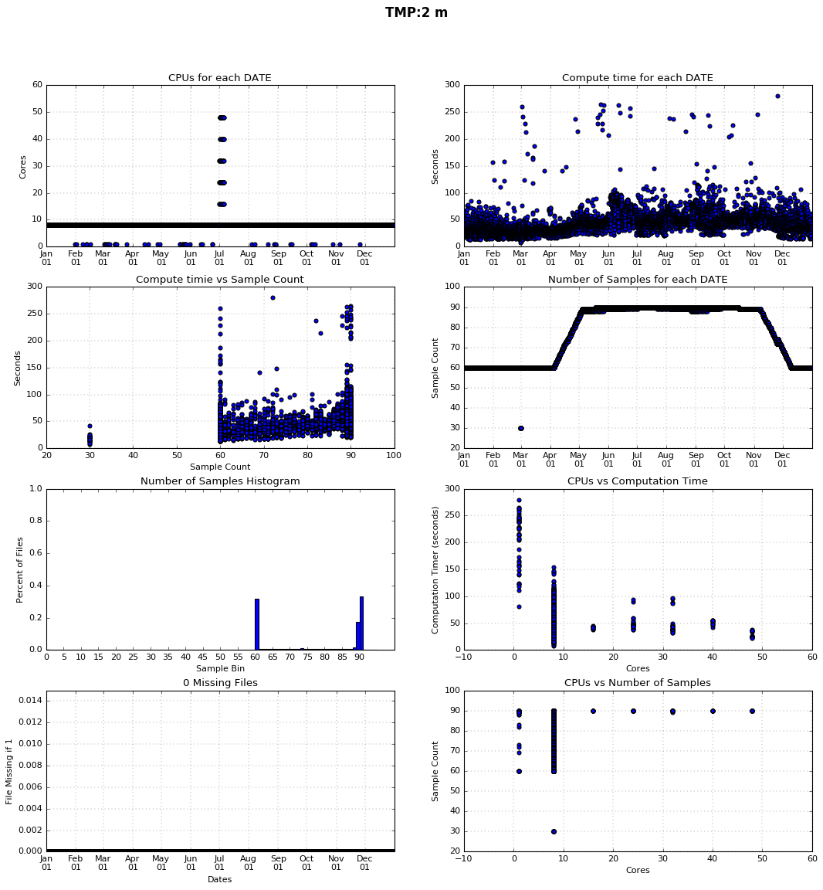
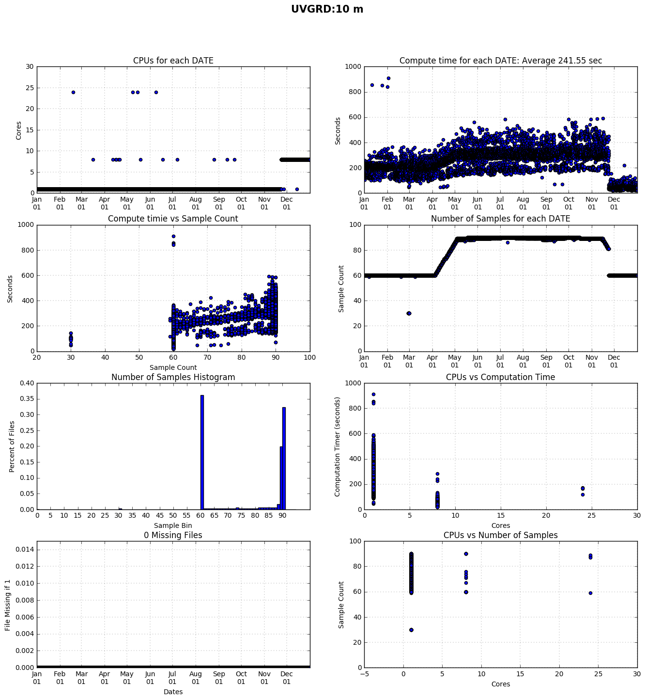
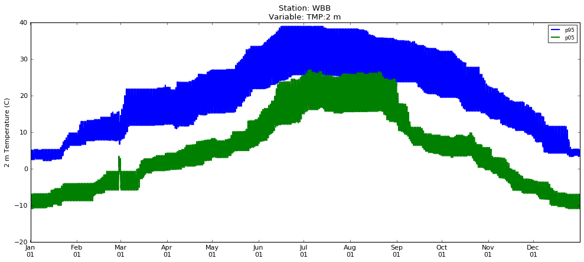
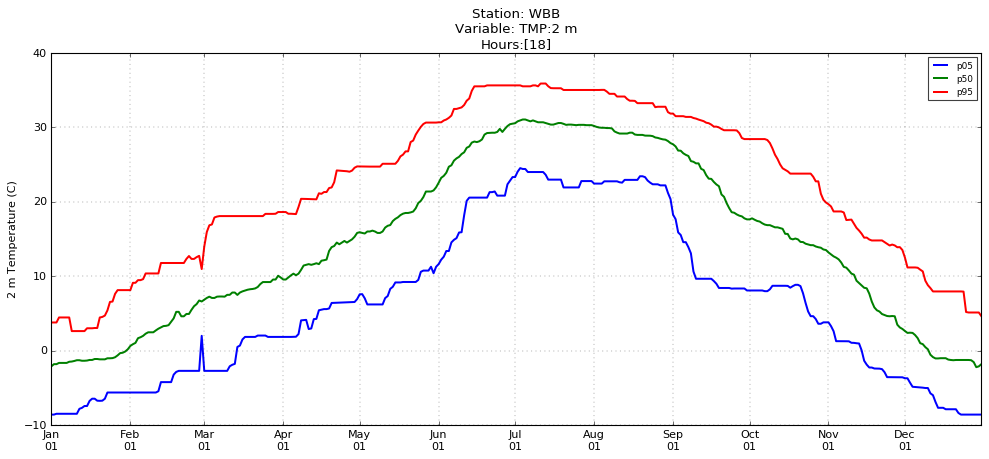
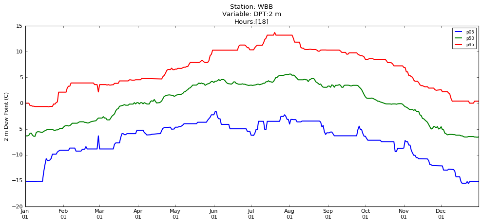

#### High Resolution Rapid Refresh Model Analytics on the Open Science Grid
# Lessons Learned Using the Open Science Grid

*Brian Blaylock  
Department of Atmospheric Science  
University of Utah  
Summer/Fall 2017*

## Introduction
Weather data are collected and generated at an increasing rate, so much that novel compute strategies are required to analyze this unprecedented voluminous "Big Data". The weather community will face "Big Data" challenges with the continued and accelerated production of massive data sets (i.e. ensemble and high resolution numerical weather prediction; higher temporal, spatial, and spectral satellite data like GOES-16; weather radar, internet of things, and forthcoming technology).

Terabytes of weather data are collected and generated every day by gridded model simulations and in-situ and remotely sensed observations. Much of this data is used few times or not used at all because this much data is expensive to archive for extended periods of time (i.e. the HRRR model is not officially archived) and traditional analysis methods cannot process "Big Weather Data."

Scientists in many disciplines use grid and cloud computing infrastructures to manage workflows for processing these massive datasets1. The [Open Science Grid](https://www.opensciencegrid.org/) (OSG) is a distributed [High Throughput Computing](https://en.wikipedia.org/wiki/High-throughput_computing) (HTC) system capable of allocating many compute resources from over 100 sites for researchers5,6. Researchers submit jobs to a queue through Condor, a scheduler that farms out the submitted jobs to opportunistic, idle compute resources on the OSG when they become available. HTC computing should not be confused with High Performance Computing (HPC) systems where few jobs are highly optimized and completed in a short amount of time.  With HTC, more can be learned from "Big Weather Data" if this data could be archived and analyzed in more intelligent way.

When I was first introduced to HTC, I was told of the "Cake Analogy". Pretend you want to bake a world-record sized cake. With HPC you would build a giant oven and bake the giant cake at once. With HTC you would bake thousands of small cakes in a normal sized oven. All the baked cakes would be brought to the same place and assembled together into the world's largest cake. For this cake example, the HTC method of creating the largest cake is the more practical solution.

- [OSG Home Page](https://www.opensciencegrid.org/)
- [OSG Status and Statistics](http://display.grid.iu.edu/)
- [OSG Help Desk](https://support.opensciencegrid.org/support/home)
- [My OSG Public](http://stash.osgconnect.net/+blaylockbk/)
- [Globus File Transfer](http://www.globus.org)
- [Globus CLI Reference](https://docs.globus.org/cli/reference/)

This document describes how the OSG system is used to efficiently compute percentile statistics of key variables from the High Resolution Rapid Refresh (HRRR) model over a three-year period (2015-2018). The HRRR data is archived on the University of Utah Center for High Performance Computing's Pando archive system2. Our HRRR archive is currently over 60 TB (February 2018), and grows by over 100 GB every day.

## About the OSG
The Open Science Grid is a worldwide consortium of computing resources5,6. Members of the consortium make their idle computing resources available to other researchers, many who would otherwise not have access to such facilities3. OSG has been used by researchers in particle physics, astronomy 1, chemistry, and other science disciplines etc.

The OSG is most useful at answering research questions that can be formulated and answered with "[embarrassingly parallel](https://en.wikipedia.org/wiki/Embarrassingly_parallel)" workflows. While OSG provisions many compute resources, each queued task works independent of each other. There is no shared file system. For this reason, some computations are not appropriate for the OSG like workflows that rely on Message Passing Interface (MPI)4.

Since these jobs use opportunistic cycles, they are at risk of being preempted by the compute resource owner. Hence, you wouldn’t want to rely on OSG for real-time or operational jobs.

There is a learning curve to get started using the OSG, but the OSG support team has a well-documented website with helpful tutorials and a responsive support staff happy to answer questions and get your jobs submitted and running.

## Research Objective: Calculating HRRR Statistics
The High Resolution Rapid Refresh (HRRR) forecast modeling system produces hourly analyses and 18 hr forecasts for the contiguous United States at 3 km grid spacing. Many people rely on these short-term forecasts for situational awareness and nowcasting8. Long-term statistics of HRRR model output are of potential benefit for a variety of purposes. 

A public archive of HRRR output beginning April 2015 is stored on an archive at the University of Utah's Center for High Performance Computing known as Pando. This highly efficient, object-storage archive allows access to the thousands of files to calculate seasonal and hourly statistics (e.g. percentiles, extremes, and forecast biases) of HRRR output variables.  I have three years of [archived HRRR model output](http://hrrr.chpc.utah.edu) for model analyses (forecast time zero). Forecast hours 1-18 are also archived, but for a shorter period. In our experience, the f00 HRRR file are good weather analysis provided every hour at 3 km grid for the contiguous United States. I am interested in quickly computing percentile statistics from the entire data set. With a size of 1059x1799 pixels, the HRRR CONUS domain has 1.9 million grid points that these statistics need to be calculated for. With 136 different meteorological variables (in the surface file) in the analysis hour and 18 forecast hours, there is a lot of data that could be sifted through. In return, much new data can be generated. This work focuses on the analysis hours (forecast hour zero), but statistics for forecast hours can also be calculated. From these statistics we can learn what the typical weather is like for every hour of the day. To reduce computational time, multiprocessing and multithreading methods are used to download multiple files from the archive simultaneously. For embarrassingly parallel computations, the Open Science Grid is being tested as a resource that can make synthesizing model statistics possible when traditional computing facilities have memory and computational limitations.  

## Method using the OSG
Tens to thousands of jobs may be submitted to a queue managed by condor, which sends the jobs to compute resources around the country. If the user wishes to do further analysis on the data sets, that data may be transferred to their institution’s home computing facilities or their own personal computer.

To use the OSG most effectively, this computation task needs to be embarrassingly parallel. Thus, it is the investigator's responsibility to formulate research questions that can be answered by embarrassingly parallel computations. 

Calculating 30-day running statistics for every hour of HRRR output can be done with parallel computing on OSG resources. I calculate a running 30-day statistic for every grid point and every hour of the year, including leap year. This requires 8,784 unique jobs (366 days * 24 hours a day) for each variable. Each job runs the same script for each hour on different OSG remote workers. For each job, the remote worker downloads 90 HRRR fields from the archive, one field for every hour in the thirty-day window centered on the hour of interest for all three years. For example, if the job is working on June 15, 0000 UTC, it will download hour 0000 UTC from May 31 through June 30 for the three years. The worker then calculates statistics for the 90 samples with numpy functions for the mean and the following list of percentiles: [0, 1, 2, 3, 4, 5, 10, 25, 33, 50, 66, 75, 90, 95, 96, 97, 98, 99, 100].

Because there is no communication between the remote workers, HRRR fields are downloaded from the archive multiple times. We acknowledge this method sacrifices efficiency, but the time is recovered by using the High Throughput Computing framework of the OSG. Computing these statistics on the OSG for each variable takes between two and three hours while it as previously taken seven days on our local compute node. Downloading and calculating statistics on a single machine is time and memory intensive. Sending each job to different machines via the OSG provides access to many more resources and completes our job quickly.

The result of this work created a new file, one for each hour of the year, with percentile and mean 30-day statistics for every grid point in the HRRR domain for the archive period. The new data set created (over 680 GB of new data per variable stored in compressed HDF5 files) was transferred to CHPC using Globus file transfer7 for further post-processing and use in various products by the MesoWest group.

This job can be completed for a single HRRR variable in about five hours on the OSG. The same job would have otherwise taken seven days to complete in serial on our locate compute resources.

### Example
Statistics for 15 June at 0000 UTC are calculated using the 0000 UTC data for the 15 days before and after 15 June 15 using all the available years (2015-2017). The data values for a single variable for the entire CONUS domain are downloaded from the HRRR archive and stored in memory. We attempt to reduce the download time by using all the available processors on the remote worker. The downloaded data is in GRIB2 format with a size on the order of 1 MB per file. When the data of the file is loaded into a Numpy array, it is bloated to a size of 7 MB per file. I found it is a good idea to requires at least 6 MB on the OSG remote workers the job is submitted to. When all the data is files are downloaded, Numpy functions calculate the mean and the percentiles. The statistics are returned in an HDF5 file along with other data such as the number of cores on the worker used to download, the time it took to calculate the statistics, and the number of sample used to calculate the statistic. 

Calculating percentiles for one variable requires downloading between 0.7-1 TB from the HRRR archive (as noted before, some data are downloaded multiple times because remote workers do not communicate with each other) and will produces up to 700 GB (84 MB per file) of new data stored in HDF5 format (could possibly be smaller with some different storage techniques or if it's converted to GRIB2, but that's not as user friendly). The Latitude and Longitude for the HRRR grid is stored in a separate HDF5 file to reduce repetitive data. There is no need to have every node return these values are known at each HRRR grid point.

In the future, when there are 2 or 3 years of additional HRRR data, this method of calculating statistics will require a computer with additional available memory. Computing the max, min, and mean of the data set is not memory intensive, but computing percentiles is memory intensive because all the values need to be stored and then sorted before finding each percentile. Approximation techniques needs to be investigated and implemented in this workflow.

## Specific OSG Methods

### [OSG Storage Types and Limits](https://support.opensciencegrid.org/support/solutions/articles/12000002985-storage-solutions-on-osg-home-local-scratch-stash-and-public)

Storage Types on OSG:
- `~` home directory: Used for long term storage, but have a file limit of 500,000 files totaling no more than 102,400 MB.
- `/local-scratch/blaylockbk/`: Short term storage. Files are deleted after 30 days. Fast writing, so it's good practice to run jobs on local-scratch and move output to stash.
- `~/stash`: Medium term storage. Slower than local-scratch. No disk quota, but is not backed up. Can use the Globus transfer service to move from stash to CHPC.
- `~/public`: Publically accessible files at [http://stash.osgconnect.net/+blaylockbk](http://stash.osgconnect.net/+blaylockbk). This data is accessible to remote workers via WGET.

When I first ran my statistics in the home space, I reach 600% of my allotted storage, but only 5% of my allotted number of files. That's when I learned about the local-scratch and stash directories, where you are expected to run your jobs and keep your output files. I remove the files from OSG as soon as the output files are moved to CHPC. My current workflow is to run my job on `/local-scratch/blaylock/`, move the output files to stash, then move those files from OSG to CHPC with [Globus]('https://www.globus.org/') file transfer.

Note: when you're trying to produce terabytes of data, there are going to be some complications.

### General Workflow
Since I still get errors when running on OSG, I have to do a little babysitting:
- Create and test a Python script that will compute the HRRR statistics and create an output file
    - Directory `daily_30` (should really be more accuratly named `hourly_30`)
        - `OSG_HRRR_composite_daily30.py` does the main work.
        - `HRRR_S3.py` contains some functions used to download the HRRR files from Pando.
        - `OSG_HRRR_run_tis.sh` is a script that helps manage the input arguments to the main python script.
- Create condor_submit script on OSG
    - A python script helps me with this. Each job with unique input arguments needs to be queued.
        - `create_daily30_job.py`
        -  `condor.submit`
- Submit the job on the OSG: 
    - `condor_submit condor.submit`
- Check that jobs are being submitted properly by checking the queue
    - `condor_q`
- Copy the files to local CHPC storage
    - Can use scp to make the copy (have another python script for this), but this requires some babysitting.
    - Transfer with Globus `globus_transfer.sh` (this should run after the DAGMan finishes)
- Look for and rerun bad files
    - Some of the files returned from OSG are incomplete, so I check the file sizes of all the files and when I see one that is smaller than the rest I rerun the job locally.
- Remove files from OSG
    - These jobs produce a lot of data. It's nice to clean up the diskspace.

### [Singularity on OSG](http://fife.fnal.gov/singularity-on-the-osg/)

Containerized applications are useful when jobs have specific software requirements. OSG supports Singularity containers.

A staff member at OSG created a singularity image for me to do my work in. This allows me to have pygrib installed in my python build, as well as a few other libraries, that are not provided in the default OSG python build. I could technically manage the singularity image myself, but I haven't learned how to do that yet. It's all still very confusing to me. The image as it is now does all I need it to do at the moment.

To run each job in the Singularity image, in the condor submission file (`condor.submit` or `dagman.submit`), you need to specify that your job is sent to an OSG remote worker that has Singularity and to send the image.  
    
    requirements = HAS_SINGULARITY == True
    +SingularityImage = "/cvmfs/singularity.opensciencegrid.org/opensciencegrid/osgvo-blaylockbk:latest/"

When you are developing and testing your scripts, you can work within the container by typing the following in the shell.

    singularity shell /cvmfs/singularity.opensciencegrid.org/opensciencegrid/osgvo-blaylockbk:latest/

You can then use the `wgrib2` command to look at grib2 file contents, and in python you can import the pygrib module like `import pygrib`.

Warning: Do not submit your jobs to condor while you are inside this container.

### Retry Failed Jobs
Sometimes, for unknown reasons to me, a job doesn't finish on the OSG. I used to simply deal with this problem by re-running those scripts locally (about 20 failed jobs). To simplify the workflow, it is possible for OSG to re-run a job if it fails. Add these lines in the condor submit file: 

    ## Retry the job if it fails  
    ## Send the job to Held state on failure.  
    on_exit_hold = (ExitBySignal == True) || (ExitCode != 0) 
    
    # Periodically retry the jobs every 10 minutes,
    ## up to a maximum of 5 retries.
    periodic_release =  (NumJobStarts < 5) && ((CurrentTime - EnteredCurrentStatus) > 600)

If you are using a DAGMan workflow, there is another way to retry the failed files.

**NOTE: The script need to have a non-zero exit code.** [source](https://support.opensciencegrid.org/support/discussions/topics/12000013002)  
In python, a clean job has an exit code of zero or if you use `sys.exit()`. Need to do some error handeling to cause your script to exit if anything is broken. I use the following to exit the program if anything fails:

    import sys
    import errno
    sys.exit(errno.EAGAIN)

 [More exit code details](https://stackoverflow.com/questions/285289/exit-codes-in-python)

### Submit jobs with Condor 
Users have the ability to specify machine requirements that their jobs should be run on. Users can request a certain operating system, minimum amount of memory, minimum amount of disk space, ability to run a Singularity container, and (others?).

I don't use these requirements, this is just an example:

    request_cpus = 1
    request_memory = 1 GB
    request_disk = 10 GB

### Using a DAGMan Workflow
Documentation: ['https://support.opensciencegrid.org/support/solutions/articles/5000639932-dagman-namd-example'](DAGMan on OSG)

We use DAGMan to manage our workflow. DAGMan is a Directed Acyclic Graph Manager used to manage workflow of many jobs. DAGMan will help manage the resubmission of jobs that terminate early due to pre-emption. "DAGMan tracks which jobs were terminated prematurely, 
and allows you to resubmit their terminated jobs with one command." 

It is best to run a DAGMan file from a local disk, such as `/local-scratch/<username>`.

#### General Workflow
|DAGMan files|Description|
|--------------------|-|
| `write_dagman.py`  |This python script writes the `splice_dag.dag` file, which sets the JOB, VARS, and RETRY for every job|
| `splice_dag.dag`   |A list of jobs to run. Each JOB points to the dagman.submit file.|
| `dagman.submit`    |The job submittion file. Contains variable `$(variable_name)` for each variable in the `splice_dag.dag` input file.|
|`globus_transfer.sh`|Attempt to automate a globus transfer of files to CHPC.|
|`dag.dag`           |This is the final file you submit via `condor_submit_dag dag.dag`|

|Script files|Description|
|-------------------|-|
| `../daily_30/OSG_HRRR_composite_daily30.py`|Python script that performs percentile calculations for each job submitted.|
| `../daily_30/HRRR_S3.py`|Contains some functions used by the main script above.|

#### DAGMan job file

We need a DAGMan file to submit many jobs to the OSG. The Python Script `write_dagman.py` creates a DAGMan file called `splice_dag.dag` by looping through a set of input variables to creates a unique job for each case. The file is in the form:

    JOB <unique job ID> <dagman submit file>
    VARS <unique job ID> <space separated list of variables>
    RETRY <unique job ID> <number of times to retry>

Example (two jobs shown):

    JOB DPT_2_m.0 dagman.submit
    VARS DPT_2_m.0 osg_python_script="OSG_HRRR_composite_daily30.py" hrrr_s3_script="HRRR_S3.py" var="DPT:2_m" month="1" day="1" hour="0" fxx="0"
    RETRY DPT_2_m.0 10
    JOB DPT_2_m.1 dagman.submit
    VARS DPT_2_m.1 osg_python_script="OSG_HRRR_composite_daily30.py" hrrr_s3_script="HRRR_S3.py" var="DPT:2_m" month="1" day="1" hour="1" fxx="0"
    RETRY DPT_2_m.1 10
    ...

The variables listed in the `splice_dag.dag` file will be used as inputs for the submit process in the dgaman.submit file for each job.

#### Submit a DAGMan Job

Submit a DAGman task using the command: `condor_submit_dag`. 

Submitted jobs are sent to remote machines when there is an opportunity to run them. Because the OSG jobs are run on opportunistic resources, they are at risk of being preempted when the hardware owner requests the resources. If a job fails, DAGMan can be configured to resubmit the job.

### Useful `condor` commands
- Submit a job: `condor_submit name_of_job_file.submit`
- Submit a job with DAGman: `condor_submit_dag dag.dag`
- View your jobs in the queue: `condor_q`
- View your Jobs (auto update): `watch condor_q` ctr-z to exit
- View individual jobs: `condor_q blaylockbk -nobatch`
- View a user's jobs: `condor_q blaylockbk`
- Remove a job: `condor_rm 1234567890`
- Check error for jobs in a hold state: `condor_q blaylockbk -hold`

I have seen about over 455 jobs running simultaneously on the OSG
The total time to calculate hourly statistics on OSG takes about 3 hours. This same work would otherwise take over 7 days if I ran this on one node at CHPC.

## Data Created

|File Name  | Total Size           |Images | Transfer OSG --> CHPC | Run time on OSG |
|-----------|----------------------|-------|-----------------------|-----------------|
|TMP:2 m    | 685 GB (~82 MB/file) |8.87 GB| 6.5 hours (8 cores)   |                 |
|DPT:2 m    | 691 GB (~84 MB/file) |GB     | 2 hours (32 cores)    | 3 hours         |
|WIND:10 m  | 704 GB (~87 MB/file) |8.98 GB| 2.5 hours (32 cores)  |                 |
|REFC:entire| 335 GB (~43 MB/file  |GB     | hours (cores)         |                 |
|LatLon     | 184 MB |

### A note about saving HDF5 files:
It is best to save each array on "top level" of the HDF5 file. My first iteration of creating these files I stored all my percentile calculations as a 3D array, requiring to get a slab of data to index the individual levels, i.e. file['percentile values'][0][10, 10] to get a point of data. It is much better and more efficient to grab data stored in 2D arrays, on the "top level" like my mean array is stored, i.e. file['mean'][10, 10]. With multiprocessing, I created a time series of the mean data at a point in 30 seconds, but it took 33 minutes to create a time series at a point for the percentile data!!! I'm pretty sure this is due to the added dimension of the percentile variable.

### Globus File Transfer between OSG and CHPC
Data Transfer of many large files is somewhat cumbersome. I used the scp command to move files from OSG to CHPC, my home institution's computing facility. The transfer rate with of my output files on OSG to CHPC is very slow with scp and it takes a long time to move the bulk of files. Transferring those files one at a time can take over a day over with scp. However, I have used multiprocessing to transfer those files in about 3 hours using 32 cores. I think the limiting factor of the transfer time is a function of the write speed to the disk and the bandwidth of the network.

Instead of an scp transfer, I use Globus to transfer files between OSG and CHPC. This has simplified and automated the data transfer after the jobs complete.

This was a little tricky to get everything set up just right. I am transferring from the **osgconnect#stash** endpoint to the **University of Utah CHPC - Blaylock_HRRR** endpoint which is active for 3 months (set expire time to 2160 under advanced options) after it is activated. You may also use the **University of Utah - CHPC DTN04 Endpoint** endpoint, but it is only active for 10 days. Transfers can be initiated with the online application (similar to WinSCP transfers), but it is most efficient to automate the transfer using the [Globus Command Line Interface](https://docs.globus.org/cli/examples/).

- On OSG, load some modules: `module load python/2.7` and `module load globus-cli`
- Login to Globus on the command line: `globus login`, and follow steps to authenticate online.
    - https://docs.globus.org/cli/examples/
- You need to know the endpoint UUID found here: https://www.globus.org/app/endpoints

I run the following script `globus_transfer.sh` within the `dag.dag` DAGMan execution file:

    #!/bin/bash
    module load python/2.7
    module load globus-cli

    # Move every .h5 file from the /local-scratch/blaylock directory to my stash directory
    mv *.h5 ~/stash/fromScratch/

    # https://docs.globus.org/cli/examples/
    # Endpoint IDs found from 'globus endpoint search Tutorial' and
    # on Globus transfer dashboard, https://www.globus.org/app/transfer,
    # Find the UUID for each endpoint here: https://www.globus.org/app/endpoints 
    ep1=9a8e5a67-6d04-11e5-ba46-22000b92c6ec    # OSG Stash Endpoint (Never Expires)
    ep2=####################################    # UofU Blaylock_HRRR Endpoint (Expires every 3 months)
                                                # Reactivate by logging into Globus
    
    # recursively transfer the OSG ~/stash/fromScratch/ folder the CHPC endpoint and desired directory
    globus transfer $ep1:~/stash/fromScratch $ep2:/~/../horel-group2/blaylock/ --recursive --label "CLI single folder"

Transferring the 8,784 files (680 GB) to `/horel-group2/blaylock/` tooks between 2-5 hours.

For this case, when we consider file transfer time as part of our workflow, running the computations on the OSG and transferring the output files to CHPC is much faster than running the statistics at my home institution. For example, the same job at CHPC on the wx4 node with 8 cores, took 7.5 days to complete whereas the jobs on OSG and transferring output to CHPC took less than 6 hours.

## OSG Data Processing Statistics
My OSG jobs typically begin running soon after submission. I've seen as many at 500 jobs run at once. The amount of time it takes for the jobs to run depends on the resources available and compute infrastructure of the remote worker. Computing resources are different on each remote machine, so parallelized code may take different amounts of time. For example, I use multiple cores to download multiple files at once. There mayb be 4-72 cores available on each remote worker.

Below shows how the number of cores, number of data samples, and total computation time are related. Note: This does not include the file transfer time between the OSG remote worker, the OSG head, and the CHPC file server.

#### Does using multiprocessing to download data speedup the calculation time?
My scripts utilize python's multiprocessing module to download all the HRRR files that are needed as quickly as possible. But it turns out that the number of processors are not well correlated to the speed to calculations are done.
Yes, downloading with multiprocessors will speed up the average computation time, but only if you are dealing with less than 12 cores. I think what happens is that the downloading saturates the network bandwidth when eight or more files are being downloaded.

#### Is the calculation time limited by the sample size?
I would expect the answer to this is "probably, yes", but 90 samples are not that many to worry about when you are calculating percentiles, and so the computation time between calculating percentiles for 30 or 90 samples isn't that great. If there were 1000 sample, then maybe there would be a difference. Again, this may depend on the compute hardware on the compute nodes.

#### How many samples are available each day?
There is a maximum of 90 samples available for each hour when 3 years of data are available. If there are two years of dat, then the maximum number of samples is 60. There as been one leap year during the time period, so there are only 30 samples available for 29 February. There are some occasional "drop-outs" that are unexplained. For some reason some hours were not able to be downloaded. This could be caused by missing files in the archive. But more often, the OSG node must have had a difficult time downloading all the files.

[Notebook for figures below](https://github.com/blaylockbk/pyBKB_v2/blob/master/OpenScienceGrid/OSG_JOB_STATS.ipynb)

## Post Processing
### Plot Maps
[Python Notebook: Make Map](https://github.com/blaylockbk/pyBKB_v2/blob/master/OpenScienceGrid/map_OSG_statistics.ipynb)
A map of the statistical data: 

Video: [Rolling 30-day maximum 10 m Wind Speed](https://youtu.be/f9DEyuOeERY)

### Time Series
[Python Notebook: Make Time Series](https://github.com/blaylockbk/pyBKB_v2/blob/master/OpenScienceGrid/plot_OSG_statistics_TimeSeries.ipynb)

It is much more efficient to store each statistical value as a key in the HDF5 file. My original method was to store the calculated percentiles as a 3D array, but that wasn't efficient to pluck values from.
Using the 32 cores on meso4, I can create a time series from a point in 30 seconds with my new HDF5 storage order, whereas before with the 3D array it took 33 minutes to generate the same time series!

#### Generating Point Time Series with Multiprocessing
After moving the statistics output from the OSG to CHPC, I can generate time series at a point location for a statistic and all hours of the year in about 3 seconds using 32 cores.

Looking at all hours at once can look somewhat noisey. Instead, it may be helpful to view a single hour of the day. Below shows temperature and dew point at WBB at 1800 UTC (local noon) for every day of the year.

---------

## Other OSG Tidbits
 - The OSG appears to run faster in the early morning. Maybe less people are on it and more remote resources are available.
 - I set up SSH keys on meso4, but had trouble setting up SSH keys on Putty, so I gave up.

## Use cases
Among the many applications for HRRR composite statistics (e.g. renewable energy and agriculture), the focus of this work is to assist incident meteorologists who are responsible for giving weather forecasts to wild fire managers. Forecasters assigned to an incident can look at composite statistics to become familiar with numerical model performance for an area they may be unfamiliar with. Compare those statistics with recent model runs and recent observations.

IMET and fire weather managers

MesoWest station validation

## Conclusions
Bottom line: OSG provides lots of computers needed for the high throughput computations. That is why we need the OSG to compute HRRR statistics.

Where commercial cloud solutions may be expensive for some science applications, resources like the OSG was a better fit for our compute needs. The Open Science Grid is a computing resource that should not be overlooked by the atmospheric science community. With its parallel processing ability meaningful new knowledge will likely be achieved from existing and future "Big Weather Data."

## Acknowledgments
This research was done using resources provided by the Open Science Grid5,6, which is supported by the National Science Foundation award 1148698, and the U.S. Department of Energy's Office of Science.

## References
1. [Juve G., M. Rynge, E. Deelman, J-S. Vockler, and G. Berriman, 2013: Comparing FutureGrid, Amazon EC2, and Open Science Grid for Scientific Workflows. *Computing in Science & Engineering*  **15** 20-29. doi: 10.1109/MCSE.2013.44.](http://ieeexplore.ieee.org/stamp/stamp.jsp?arnumber=6497031)

2. [Blaylock, B. K., J. D. Horel, S. T. Liston, 2017: Cloud archiving and data mining of High-Resolution Rapid Refresh forecast model output. *Computers and Geosciences*. **109**, 43-50. doi: 10.1016/j.cageo.2017.08.005.](https://doi.org/10.1016/j.cageo.2017.08.005)

3. [Pordes R., et al., 2008: New science on the Open Science Grid. Journal of Physics: Conference Series. *125* 1-6. doi: 10.1088/1742-6596/125/1/012070/](http://iopscience.iop.org/article/10.1088/1742-6596/125/1/012070/meta)

4. [Is High Trouput Computing for you?](https://support.opensciencegrid.org/support/solutions/articles/5000632058-is-high-throughput-computing-for-you-)

5. [Pordes, R. et al. 2007: The Open Science Grid, *J. Phys. Conf. Ser.* **78**, 012057. doi:10.1088/1742-6596/78/1/012057.](http://iopscience.iop.org/article/10.1088/1742-6596/78/1/012057/pdf)

6. [Sfiligoi, I., D. Bradley, B. Holzman, P. Mhashilkar, S. Padhi, and F. Wurthwein, 2009: The Pilot Way to Grid Resources Using glideinWMS, *2009 WRI World Congress on Computer Science and Information Engineering*, **2**, 428–432. doi:10.1109/CSIE.2009.950.](http://ieeexplore.ieee.org/stamp/stamp.jsp?arnumber=5171374)

7. [Globus](https://www.globus.org/)

8. [Benjamin, S. G., and Coauthors, 2016: A North American Hourly Assimilation and Model Forecast Cycle: The Rapid Refresh. *Mon. Wea. Rev.* 144, 1669-1694, doi:10.1175/MWR-D-15-0242.1.](http://journals.ametsoc.org/doi/full/10.1175/MWR-D-15-0242.1)

-----------
-----------
# Old discussion of first attempt statistics
Because I only have 2.5 years of data, a loop showing a map of the maximum or minimum values appears to show features of two underlying weather features move around the map. These are caused by the extreme events for the day

Python multiprocessing is easy to utilize, but doesn't really gain me much ground for what I'm doing. Primarily, multiprocessing is used to speed up the downloads, but it doesn't appear it makes much difference in the compute time. The download speed becomes saturated after 8 cores are used.

The OSG resources are nice for these brute-force percentile computations when they need to be
re-run. For example, if you ran these calculation every week or every month, on 
your own computer it would take over 7 days. On OSG it only takes several hours.
However, you can get away from doing this for more simple calculations (i.e. sum, mean, max, min, RMSE) that can be calculated by only hold one value in memory (no sorting required, like there is for the percentile calculation). For these rolling statistics, you could save values and update the data without requiring the throughput OSG provides.

### Example
To give you an idea of the speed of computing on OSG, I have a job that would take about 2 hours to run on the meso4 server, which has 32 processors, and created 288 ~65MB files. In comparison, I submitted the same job to the OSG, which ran in about 15 minutes. The difference is that I ran the 288 jobs on meso4 in serial, whereas I ran the 288 jobs simultaneously on the OSG, each with between 8-48 processors,as soon as the computing resources become available. If you don't account for the time in the queue waiting for resources to become available, it takes less than one minute (typically between 10-60 seconds with an average time of 30 seconds) to complete the computations on the 8,000+ cores. The trade off is in the transfer time...transferring the files from the compute node (farmed out somewhere in the United States) to my OSG home directory, and then from the OSG home directory to meso4 via scp. The transfer of files from OSG to meso4 can take up to 24 minutes if done in serial (about 4-5 seconds per file, and need to transfer 288 files).

### History of Statistics Work
My first attempt calculated the hourly statistics for each month, a job that could be done in 288 parts (12 months * 24 hours). This method gave me about 60-90 samples for each hour (60 samples if two years are available, or 90 samples if three years are available). This produced much less data, but a timeseries of the data was not continous. Each month was a unquie statistic. It is much better to calculate the 30-day running statistics where each hour is a unique statistic.

I didn't calculate as many statistics as I had before, only computing the mean, max, min and [1, 5, 10, 90, 95, 99] percentiles. 

I origianally stored the statistics data in NetCDF files, but these filese were so bloated it would have been too much data to store in memory. I used compression level=1 which reduced a 180 MB file to a 65 MB file. I later changed to HDF5 which has reduced the file sizes substantially (83 MB per file for a file with many more percentiles stored). Using HDF5 instead of NetCDF was a smart move, especially after I doubled the number of calculated statistics. The file size as HDF5 with the 20 statistics was about the same size as the NetCDF file with the 9 statistics.
